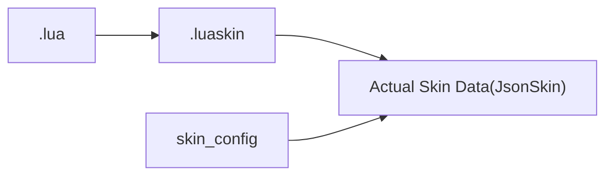
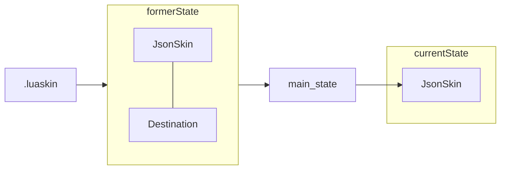
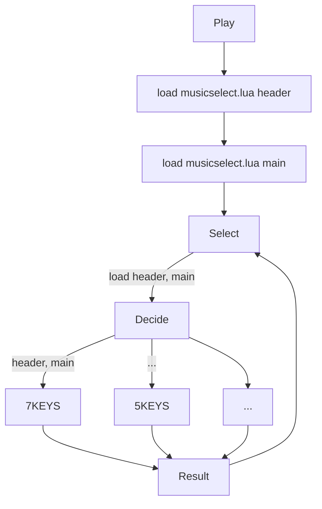

# 기본적인 정보
- 비토라자는 lua스크립트를 .luaskin이라는 파일을 통해 스킨을 불러오는 방식으로 호출함
- lua파일의 호출 시점은 대부분 장면 전환 시점이기에 장면 중에 다이나믹하게 작동될 수 없음(일부 예외 이벤트들 제외)
- 비토라자에선 기본적으로 파일경로, 옵션, 오프셋 등을 기록한 skin_config 글로벌 변수에 접근할 수 있음
- .luaskin에선 skin_config의 유무에 따라 lua코드의 메인이나 헤더를 반환함.
- 헤더를 반환하는 경우 스킨(.luaskin)에 대한 기본적인 정보를 얻기 위함임.
- 메인을 반환하는 경우 사용자가 설정한 스킨 옵션에 따른 실제 스킨을 얻기 위함임.

- Destination 클래스의 draw 변수를 통해 부울값을 반환하는 클래스를 전달하거나 옵션 ID를 전달할 수 있어 보다 좀 더 동적인 스킨 제작이 가능하다.
- 만약 draw 변수에 함수를 넣었을 경우 그 함수는 매 프레임 호출되어 값을 반환하기 때문에 실시간으로 특정한 조건을 만족하면 실행되는 기능을 만들 수 있다.
- .lua의 첫 실행 시 비토라자의 게임 상태를 참조하기 위해 main_state라는 모듈을 사용함.

- 커스텀 타이머나 커스텀 이벤트를 등록하여 추가적인 타이머와 이벤트를 등록할수 있음
- 커스텀 타이머의 timer 필드를 비워두면(아마 지금은 timerFunc인 듯) main_state_set_timer(id, value)에 의해 값을 세팅만 할 수 있는 수동적 타이머를 만들 수 있음.
- 커스텀 타이머와 이벤트의 ID는 현재 각각 10000 ~ 19999, 1000 ~ 1999에 할당 가능함.

# 대략적인 lua의 흐름(아마도, 뇌피셜)

