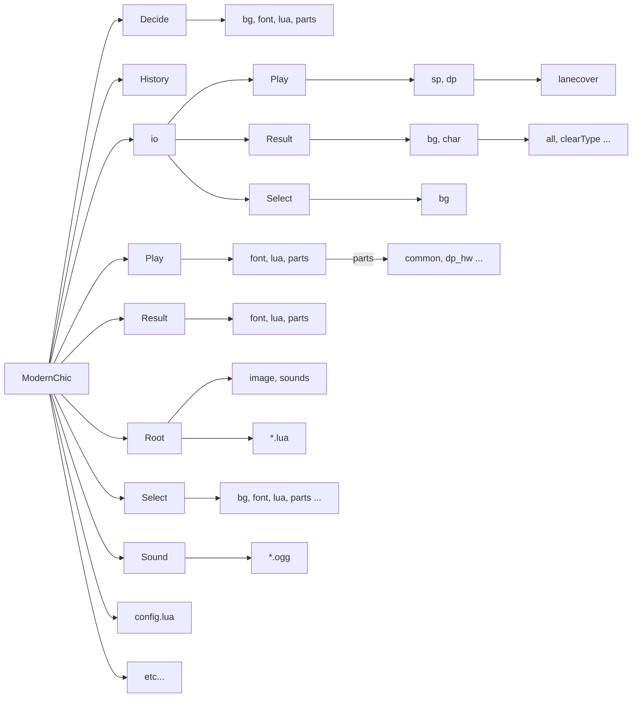

# 비토라자 Overview

## 구조(ModernChic 기준)

```mermaid
graph LR;
n1[ModernChic] --> n2[Decide]
n2 --> n2_1[bg, font, lua, parts]
n1 --> n3[History]
n1 --> n4[io]
n4 --> n4_1[Play]
n4_1 --> n4_1_1[sp, dp] --> n4_1_2[lanecover]
n4 --> n4_2[Result]
n4_2 --> n4_2_1[bg, char] --> n4_2_2[all, clearType ...]
n4 --> n4_3[Select] --> n4_3_1[bg]
n1 --> n5[Play]
n5 --> n5_1[font, lua, parts] -->|parts| n5_1_1[common, dp_hw ...]
n1 --> n6[Result] --> n6_1[font, lua, parts]
n1 --> n7[Root]
n7 --> n7_1[image, sounds]
n7 --> n7_2[*.lua]
n1 --> n8[Select] --> n8_1[bg, font, lua, parts ...]
n1 --> n9[Sound] --> n9_1[*.ogg]
n1 --> n10[config.lua]
n1 --> n11[etc...]
```
 
## 폴더
- [[Decide]]
- History: 자신의 클리어, 점수, 임프레 등의 기록을 보관
- [[io]]
- [[Play]]
- [[Result]]
- [[Root]]
- [[Select]]
- [[Sound]]
- [[ModernChic-Lua]]