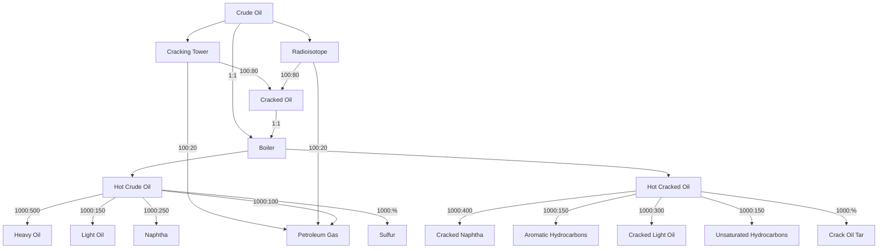

개 똥 모드의 개 똥 파트

```mermaid
graph TD;
crude[Crude Oil]--1:1-->boiler[Boiler];
crude-->cracking[Cracking Tower];
crude-->radiolysis[Radioisotope];
cracking--100:80-->cracked_oil[Cracked Oil];
cracking--100:20-->petroleum_gas;
radiolysis--100:80-->cracked_oil;
radiolysis--100:20-->petroleum_gas;
cracked_oil--1:1-->boiler;
boiler-->hot_crude[Hot Crude Oil];
boiler-->hot_cracked[Hot Cracked Oil];
hot_crude--1000:500-->heavy_oil[Heavy Oil];
hot_crude--1000:150-->light_oil[Light Oil];
hot_crude--1000:250-->naphtha[Naphtha];
hot_crude--1000:100-->petroleum_gas[Petroleum Gas];
hot_crude--1000:%-->sulfur[Sulfur];
hot_cracked--1000:400-->cracked_naphtha[Cracked Naphtha];
hot_cracked--1000:150-->aromatic_hydro[Aromatic Hydrocarbons];
hot_cracked--1000:300-->cracked_light_oil[Cracked Light Oil];
hot_cracked--1000:150-->unsaturated_hydro[Unsaturated Hydrocarbons];
hot_cracked--1000:%-->crack_oil_tar[Crack Oil Tar];
```